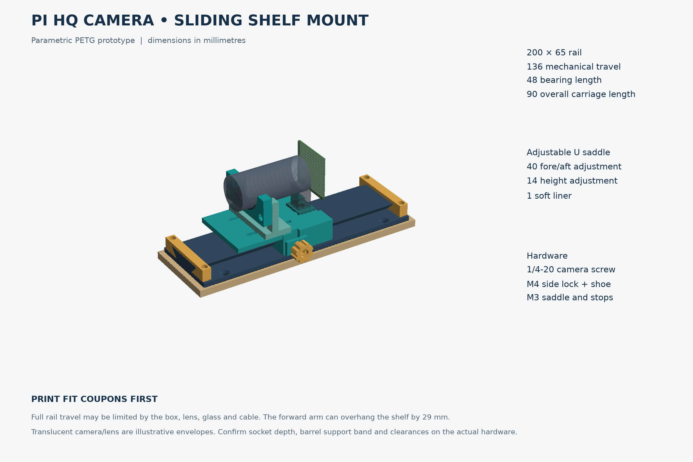

# Pi HQ Camera sliding shelf mount

Printable prototype for the **70 × 210 mm pine shelf**, using the existing
**1/4″-20 tripod socket** and an adjustable, lightly padded lens support.
All CAD/STL dimensions are **millimetres**. **Print the fit coupons first.**



## Files

- `stl/`: individual parts, already oriented for printing. Print two end stops;
  one of every other production part. The three files containing `fit_` or
  `coupon` are tests, not extra installed components.
- `source/model.py` + `source/parameters.json`: editable parametric CadQuery CAD.
- `source/build.py`: regenerates STL, STEP, checks, and overview from that CAD.
- `step/assembly.step`: assembled mechanical model; individual STEP files retain
  assembly coordinates. STEP geometry is editable, but parameters live in source.
- `docs/verification.json`: numerical check results, mesh sizes and limitations.

## Dimensions and limits

| Item | Dimension |
|---|---:|
| Fixed rail | 200 × 65 × 12 |
| Shelf margins when centred | 5 each end; 2.5 each side |
| Dovetail | 24 bottom width → 40 top width; 8 high; 45° flanks |
| Sliding allowance | 0.30 normal to each flank; 0.30 vertical roof clearance |
| Carriage bearing / overall length | 48 / 90 |
| Mechanical rail travel | **136** = 200 − 8 − 8 − 48 |
| Deck / camera seating height above shelf | 23.3 / **25.3** |
| Saddle support plane ahead of tripod screw | **30.3–70.3**, a 40 mm range |
| Saddle valley above deck, before liner | **10–24**, a 14 mm range |
| Saddle inside radius / liner | 20 / 1 |
| Saddle foot width | 58 |
| Hand knob | Ø17 × 8; M4×16 screw |
| Arm / saddle screw heads above end stop | 4.3 / 0.8 clearance |
| Camera screw projection above 2 mm pad | **3.525**, with specified 3/8″ screw |

At full forward travel, the arm can project **29 mm beyond the shelf end**.
The knob reaches about **8.5 mm beyond the shelf side** in the illustrated
position; allow additional room for loosening and fingers. The lens can extend
farther than the arm. **136 mm is mechanical travel, not verified usable travel
inside this box.** The future glass, lens controls, cable and enclosure can limit it.
Check the entire sweep before installing glass. This is a clearance-fit printed
slide; locking can take up about 0.42 mm of lateral play. Align the final view
with the lock tightened rather than treating it as a precision optical stage.

## Bill of materials

| Qty | Item | Notes |
|---:|---|---|
| 1 each | Rail, carriage, camera pad, pressure shoe, knob, saddle foot, U cradle | PETG |
| 2 | End stop | Same STL twice; removable |
| 1 | Optional soft liner | TPU; or cut soft sheet as below |
| 1 | **1/4″-20 × 3/8″** low-profile/button-head screw | Under-head length 9.525 mm; modeled head Ø11.2 × 3.3 high; no large D-ring head |
| 1 | **M4 × 16 hex-head screw**, fully threaded | 7 mm across-flats head, about 2.8 high; goes into printed knob |
| 1 | M4 ordinary hex nut | 7 AF × 3.2 thick; not a taller nyloc nut |
| 4 | **M3 × 12 socket-head screws** | End stops; head Ø5.5 × 3 |
| 2 | **M3 × 10 socket-head screws** | Saddle foot, inserted from underside |
| 2 | **M3 × 16 socket-head screws** | Height adjustment |
| 8 | M3 ordinary hex nuts | 5.5 AF × 2.4 thick; four rail, two foot, two cradle |
| 4 | M3 washers, **7 OD × 0.5 thick** | Two foot screws; two height screws |
| 4 | About Ø3.5 countersunk wood screws | Head ≤8 mm; rail holes 4.4 with 8.4 countersink |
| 1 | Thin TPU/neoprene/felt contact pad | Nominal 1 mm; curved liner or roughly 8 × 42 mm strip |
| Small amount | Adhesive for knob head / pad; optional nut retention | Keep out of threads and sliding faces |

Choose wood-screw length **after measuring shelf thickness and bracket locations**.
For example, a 12 mm countersunk screw through the 4 mm base embeds about 8 mm
into pine. Leave at least 2–3 mm to the shelf underside; do not hit the brackets.
Use pilot holes suited to the actual screws (about 2–2.5 mm for many 3.5 mm
softwood screws), and tighten only until the rail lies flat. Do not bend the rail
to follow an uneven board. The screw size examples are not a pull-out rating.

## Print settings

- PETG: 0.4 mm nozzle, **0.20 mm layers, 4–5 walls, 5 top/bottom layers,
  35–45% gyroid/cubic infill**. Use 5 walls and 45% for carriage and saddle foot.
- Start with the filament maker's profile; typically 235–250 °C nozzle and
  75–85 °C bed for PETG. Dry the filament. Use moderate cooling and about
  25–35 mm/s on sliding surfaces. A 3–5 mm brim can help the long rail stay flat.
- Production pieces are already oriented: rail base down; carriage deck down
  (upside down in use); stops top down; saddle foot flat on its base; cradle and
  shoe on an end face; knob pocket up; camera pad flat.
- No full-length supports should be needed for the 45° dovetails. Small bridges
  occur over holes/nut pockets and the ribbon relief. Preview them in the slicer;
  use local supports only if your printer cannot bridge them. Keep supports off
  sliding faces and remove all nibs from hardware recesses.
- Do **not** scale STLs to adjust fit: that changes screw spacing and diameters.
  Change `flank_clearance` in the parameters instead. Compensate first-layer
  bulge in the slicer and lightly deburr rail entrances.
- Optional liner: TPU around 95A, 0.20 mm layers, 100% infill, slow printing,
  axis vertical as supplied. Do not print the liner in rigid PETG. A cut and
  lightly glued 1 mm neoprene/felt strip is also suitable; thicker material
  changes the required height.
- The 200 mm rail needs a bed that can accommodate it plus any brim. Inspect
  layer preview before committing to the print. No printer-specific G-code is supplied.

## Test before a full print

1. **Dovetail and lock:** print `fit_rail`, `fit_carriage`, `pressure_shoe` and
   `lock_knob` with the production profile. The coupon carries the real lock
   pockets; the rail coupon also includes the real M3 nut and wood-screw holes.
   Check those against your hardware. It should slide by hand without rocking excessively. Install the
   M4 nut, shoe and screw; confirm the knob locks and releases it without
   bottoming on the boss. Start at 0.30 per flank; change by 0.05 if necessary.
   A short coupon cannot detect bow along the full 200 mm rail.
2. **Camera screw:** print `camera_screw_coupon` and `camera_pad`. Invert the
   coupon into its use orientation, place the pad on its flat top, and insert
   the actual camera screw from the recessed side. Check the head fits the
   **13 mm recess** and the pad bears only on the tripod block, not PCB, ribbon
   connector, or solder joints. Measure actual protrusion and socket depth.
   **The 3.525 mm projection is a design value, not confirmed safe engagement
   for this particular socket.** Do not bottom the screw. Use a suitable screw
   length or revise pad thickness, and recheck saddle height if it changes.
3. **Lens support:** measure the stationary barrel band that can carry load.
   The nominal trial barrel is 30 mm OD; the open cradle is intended to trial
   approximately 24–36 mm OD with a 1 mm liner. This is not a guarantee for all
   C/CS lenses. Confirm no focus/aperture ring, small locking screw, moving
   barrel, or lens-mount adjustment is pressed by the saddle or uprights.
4. **Height:** measure from the mounted camera seating plane to the bottom of
   that barrel band. The bare cradle trough is **8–22 mm above the camera pad**,
   or approximately **9–23 mm with a 1 mm liner**. If your measurement falls
   outside this range, revise the saddle before printing it. The lens should
   rest gently; raising the saddle must not lift or bend the camera assembly.
5. **Cable and box:** the rear relief is 24 wide × 5 long × 3 deep, with a 2 mm
   camera spacer. Check this against the actual board and cable exit. Route a
   free slack loop behind the carriage, away from dovetail, screw and end stop.
   Check both ends of travel without pulling or creasing the ribbon. Measure
   the actual glass distance and stop early enough to avoid striking it.

## Assembly

1. Clean all holes and sliding faces. Seat four M3 nuts in the rail's underside
   pockets. A small adhesive dot can hold them during installation. Centre the
   rail on the shelf, mark/pilot four wood holes, then screw the rail down flat.
2. Fit the rear stop with two M3×12 screws. Their heads recess into the stop;
   check tips remain flush with or above the rail underside. Leave the front
   stop off to load the carriage later.
3. Press/glue the M4 screw's hex head into the knob, keeping adhesive off its
   shank. Insert the M4 nut through the top loading slot in the carriage boss.
   Insert the pressure shoe through the **empty dovetail cavity**, sloping face
   toward the rail and flat face toward the screw. Thread in the knob just
   enough to retain the shoe. The rail retains it after carriage installation.
4. With the carriage off the rail, insert the camera screw from underneath,
   add the 2 mm camera pad, then attach the camera by its tripod block. Align
   the lens along X and tighten gently. Do not transmit tightening force through
   the PCB or lens rings. Attach/reseat ribbon only with the Pi powered off.
5. Put two M3 nuts into the top pockets of the saddle foot. Insert two M3×10
   screws and 0.5 mm washers **from below** through the carriage's long slots
   into those nuts. Set the desired support position and snug them. These
   underside screws are most easily adjusted with the carriage off the rail;
   longitudinal saddle adjustment is not intended to be tool-free in place.
6. Seat two M3 nuts in the cradle's front pockets. Place the cradle forward of
   the foot's two uprights, with its concave face upward. Fit two M3×16 screws
   and washers through the upright height slots into the cradle nuts. Add the
   soft liner. Start low, then raise evenly until it just takes the lens weight.
   Tighten both screws evenly, maintaining the 0.3 mm gap between upright and
   cradle except where normal clamping closes it. The U remains open; no strap
   or tight barrel clamp is required.
7. Feed the carriage onto the rail from the open end, keeping the shoe in its
   pocket and all fastener heads recessed. Attach the front stop with the other
   two M3×12 screws. Check complete motion, cable slack and box clearance.
8. Tighten the side knob **finger-snug only**. It drives the shoe against one
   flank and seats the opposite flank. Release only enough to slide; there is
   no need to remove the knob. Inspect after the first day of use for settling
   or PETG creep. This prototype has not been physically load-tested.

## Editing and regeneration

CadQuery uses Python for native parametric solids. The JSON exposes the major
dimensions; detailed hardware pocket geometry is in `model.py`. STEP files are
included for CAD applications that do not run CadQuery. For a dedicated local
Python environment (Python 3.14 was used here):

```sh
python3 -m venv .venv
.venv/bin/pip install -r source/requirements.txt
.venv/bin/python source/build.py
```

Run from this folder. The build overwrites generated parts and verifies them.
Major size changes may also require moving hardware features in source; the
parameter file is not an automatic universal-lens configurator. Rerun the build
and check hardware lengths after every dimensional change. Export tolerances:
0.03 mm linear / 0.08 rad angular for STL. The solid STEP model is not faceted.

## Verification scope and references

The supplied source checks valid single solids, positive volume, watertight STL
meshes, 27 combinations of rail travel/saddle position/height, representative
fastener envelopes against printed components, end-stop blocking and dovetail
capture. A separate locked-pose check verifies shoe contact and knob clearance.
Continuous operation is additionally assessed from the uniform rail profile and
positive vertical clearance over both stops. These checks do **not** substitute
for printer tolerances, strength/creep tests, or exact camera/box measurements.

The supplied **IMG_8487.JPG** was recovered from the referenced conversation and
visually inspected. It established the lens direction, pine shelf, rear ribbon
exit and nearby enclosure wall. Perspective and lack of a scale prevent reliable
measurement of the tripod block, barrel, socket depth or glass position.

Raspberry Pi confirms the HQ Camera's 1/4″-20 tripod socket on its
[official product page](https://www.raspberrypi.com/products/raspberry-pi-high-quality-camera/).
Its [CS camera mechanical drawing](https://pip-assets.raspberrypi.com/categories/659-raspberry-pi-high-quality-camera/documents/RP-008200-DS-1-hq-camera-cs-mechanical-drawing.pdf)
is a useful reference; this design does not claim a measured custom fit to the
specific lens or board shown in the photograph.
